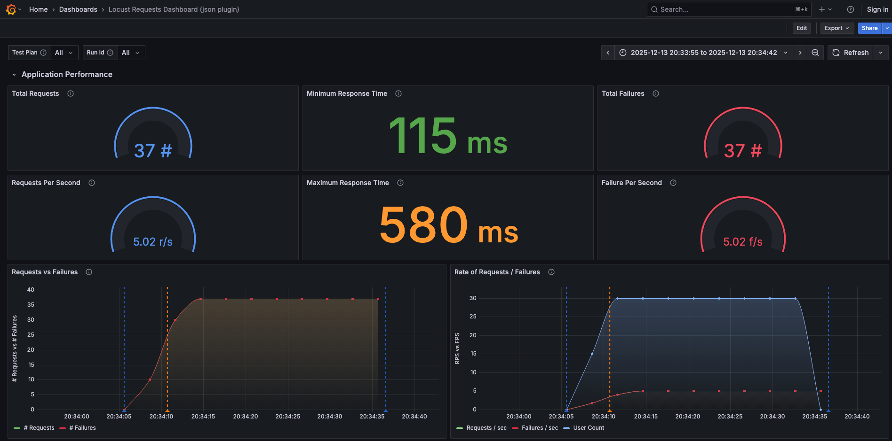
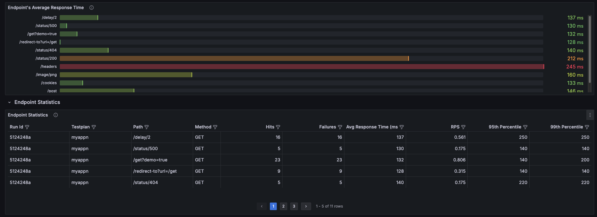
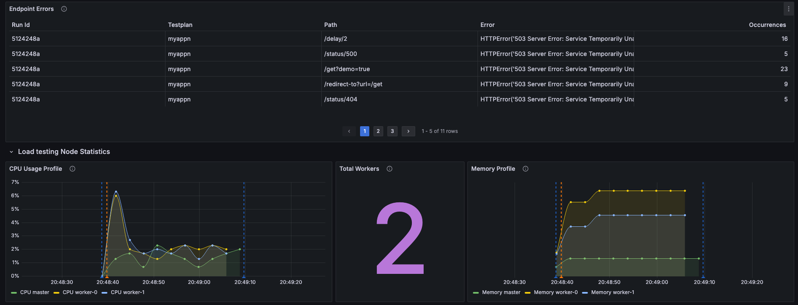
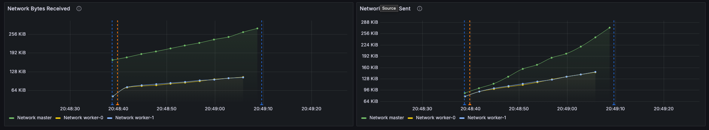

.. _examples-section:

Examples
=======================================

Locust Telemetry supports two telemetry types: **JSON** and **OpenTelemetry**.
Select the type by setting the recorder in the configuration.

.. note::
   Tests currently do not emit traces or spans. See :ref:`help` for contributing.

JSON Telemetry
--------------------

Example: running **locust_telemetry** locally with **Grafana**, **Loki**, and **Promtail**.

**Local Setup**

- **Clone the repository**:

    .. code-block:: bash

        git clone git@github.com:platform-crew/locust-telemetry.git
        cd locust-telemetry/examples/local-json

- **Build Docker containers**:

    .. code-block:: bash

        make build && make up

    Launches:
    - Locust master & worker
    - Loki (logs)
    - Promtail (log shipping)
    - Grafana (visualization)

- **Access UIs**:
    - Locust: ``http://localhost:8089``
    - Grafana: ``http://localhost:3000``

- **Run Load Test**:
    1. Go to Locust Web UI
    2. Click **Start**

- **View Test Runs in Grafana**:
    1. Open the Test Runs dashboard
    2. Wait ~20s for metrics
    3. Click a test run for details

**Sample Grafana Dashboards**

.. image:: _static/load-test-runs.png
   :alt: All Load Test Runs
   :width: 100%
   :align: center

**Structured Log Parsing**

Recommended indexed fields for dashboards:

- **run_id** → test run identifier
- **testplan** → test plan name
- **recorder** → master/worker
- **telemetry_type** → event or metric
- **telemetry_name** → specific metric/event

**Promtail Pipeline Example**

.. code-block:: yaml

    pipeline_stages:
      - json:
          expressions:
            run_id: telemetry.run_id
            recorder: telemetry.recorder
            testplan: telemetry.testplan
            telemetry_type: telemetry.telemetry_type
            telemetry_name: telemetry.telemetry_name
            level: telemetry.level
            message: telemetry.message
            ts: telemetry.time

      - labels:
          run_id: run_id
          testplan: testplan
          recorder: recorder
          telemetry_type: telemetry_type
          telemetry_name: telemetry_name

      - match:
          selector: '{run_id=""}'
          action: drop

      - timestamp:
          source: ts
          format: RFC3339

OpenTelemetry Telemetry
--------------------------
