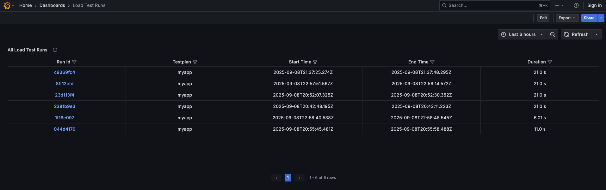
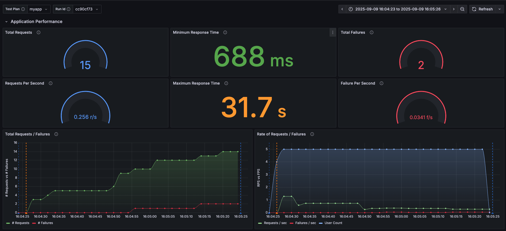
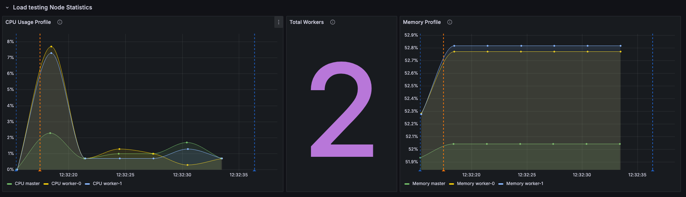

.. _examples-json-section:

Structure Json Logging
=======================================

The following example demonstrates how to run **locust_telemetry** locally
and use **Grafana**, **Loki**, and **Promtail** to visualize the generated
Locust metrics and logs in real time.

Local Grafana, Loki & Promtail
---------------------------------------------------------

Easily run **locust_telemetry** locally with Grafana, Loki, and Promtail by
following these steps.

- **Clone the repository** (if not done already):

    .. code-block:: bash

        git clone git@github.com:platform-crew/locust-telemetry.git
        cd locust-telemetry/examples/local-json

- **Build the Docker containers**:

    .. code-block:: bash

        make build && make up

        This will launch the following services:

        - Locust master and worker containers
        - Loki for log aggregation
        - Promtail for log shipping
        - Grafana for visualization

        Logs will be displayed automatically.

- **Access Locust Web UI**:

    Open your browser and go to: ``http://localhost:8089``

- **Access Grafana**:

    Grafana comes pre-configured with anonymous access and preloaded dashboards.

    Open your browser and go to: ``http://localhost:3000``

- **Run a Load Test On Test Site**

    1. Go to the Locust Web UI: ``http://localhost:8089``
    2. Click **Start** (all fields are prefilled)

- **View Test Runs In Grafana**

    1. Open the Test Runs dashboard: ``http://localhost:3000/d/2a1a2a1b-5407-44dd-860f-1c9361750049/load-test-runs?orgId=1&from=now-6h&to=now&timezone=browser``
    2. Wait ~20 seconds for the tests to complete.
    3. Click on a test run to view its detailed dashboard.

Sample Grafana Dashboards
~~~~~~~~~~~~~~~~~~~~~~~~~~~

Below are sample Grafana dashboards created from the ingested logs.
These visualizations show how Locust Telemetry metrics can be explored
and correlated in your observability stack.

**All Load Test Runs**

Select a test run to view its detailed dashboard.

.. raw:: html

     

**Load Test Request Dashboard**

The dashboard provides a comprehensive view of request statistics,
failure rates, endpoint performance, and system metrics from both the
master and worker nodes, along with additional telemetry insights.

.. image:: _static/request-dashboard-2.png
   :alt: Request Dashboard
   :width: 100%
   :align: center

.. image:: _static/request-dashboard-3.png
   :alt: Request Dashboard
   :width: 100%
   :align: center

.. raw:: html

     

Local Log Parsing
-----------

To make dashboards load quickly and filters work seamlessly, Locust Telemetry
logs should be parsed into structured fields and indexed efficiently.

At a minimum, the following fields are recommended as indexes/facets:

- **run_id** → identifies a specific test run
- **testplan** → test plan name
- **recorder** → recorder instance (e.g., master/worker)
- **telemetry_type** → type of telemetry (event or metric)
- **telemetry_name** → specific event/metric name

Promtail Pipeline
~~~~~~~~~~~~~~~~

The snippet below shows how to configure a Promtail log parser.
The same approach can be adapted for other observability tools such as
Datadog, ELK, or OpenTelemetry by extracting the same fields.

.. code-block:: yaml

   pipeline_stages:
     - json:
         expressions:
           run_id: telemetry.run_id
           recorder: telemetry.recorder
           testplan: telemetry.testplan
           telemetry_type: telemetry.telemetry_type
           telemetry_name: telemetry.telemetry_name
           level: telemetry.level
           message: telemetry.message
           ts: telemetry.time

     - labels:
         run_id: run_id
         testplan: testplan
         recorder: recorder
         telemetry_type: telemetry_type
         telemetry_name: telemetry_name

     - match:
         selector: '{run_id=""}'
         action: drop

     - timestamp:
         source: ts
         format: RFC3339
