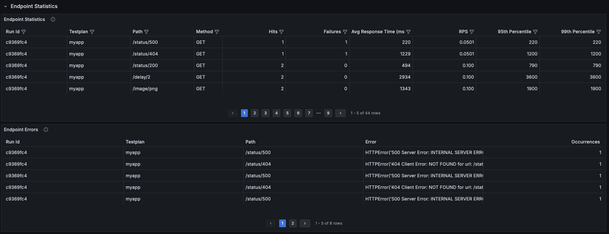

.. _examples-section:

Examples
=======================================
The following example demonstrates how to run **locust_telemetry** locally
and use **Grafana**, **Loki**, and **Promtail** to visualize the generated
Locust metrics and logs in real time.

Local Grafana, Loki & Promtail
---------------------------------------------------------

Easily run **locust_telemetry** locally with Grafana, Loki, and Promtail by
following these steps.

- **Clone the repository** (if not done already):

    .. code-block:: bash

        git clone git@github.com:platform-crew/locust-telemetry.git
        cd locust-telemetry/examples/local

- **Build the Docker containers**:

    .. code-block:: bash

        make build && make up

        This will launch the following services:

        - Locust master and worker containers
        - Loki for log aggregation
        - Promtail for log shipping
        - Grafana for visualization

        Logs will be displayed automatically.

- **Access Locust Web UI**:

    Open your browser and go to: ``http://localhost:8089``

- **Access Grafana**:

    Grafana comes pre-configured with anonymous access and preloaded dashboards.

    Open your browser and go to: ``http://localhost:3000``

- **Run a Load Test On Test Site**

    1. Go to the Locust Web UI: ``http://localhost:8089``
    2. Click **Start** (all fields are prefilled)

- **View Test Runs In Grafana**

    1. Open the Test Runs dashboard: ``http://localhost:3000/d/2a1a2a1b-5407-44dd-860f-1c9361750049/load-test-runs?orgId=1&from=now-6h&to=now&timezone=browser``
    2. Wait ~20 seconds for the tests to complete.
    3. Click on a test run to view its detailed dashboard.

Sample Grafana Dashboards
---------------------------------------------------------

Below are sample Grafana dashboards created from the ingested logs.
These visualizations show how Locust Telemetry metrics can be explored and correlated in your observability stack.

**All Load Test Runs**

.. image:: _static/load-test-runs.png
   :alt: All Load Test Runs
   :width: 100%
   :align: center

.. raw:: html

     

**Load Test Request Dashboard**

.. image:: _static/request-dashboard-1.png
   :alt: Request Dashboard - Overview
   :width: 100%
   :align: center

.. raw:: html

     

.. image:: _static/request-dashboard-2.png
   :alt: Request Dashboard - Latency
   :width: 100%
   :align: center

.. raw:: html

     

.. raw:: html

     
