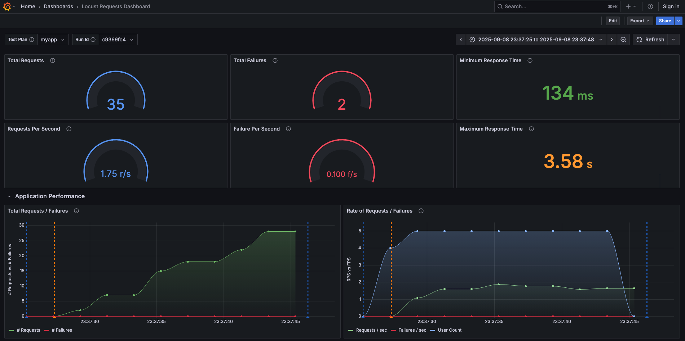
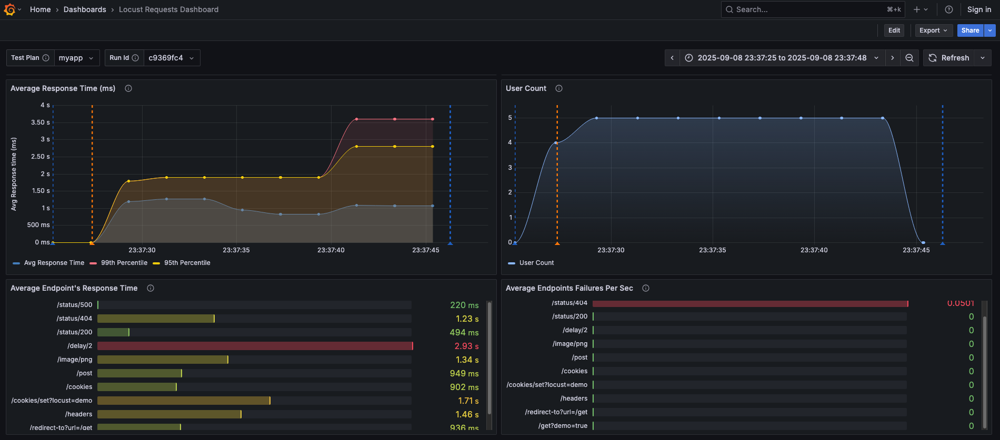

.. _quickstart:

Quick Start
===========

This extension builds on Locust, and all existing usage and configuration
options remain unchanged. For details on how Locust works, please refer
to the official Locust `documentation <https://docs.locust.io/en/stable/index.html>`_.

Once Locust is set up, load the core telemetry plugin in your
Locust test script (e.g., locustfile.py):

.. code-block:: python

    from locust_telemetry.core_telemetry.plugin import entry_point
    entry_point()

.. note::
   - Telemetry plugins are implemented as singletons, so loading a plugin multiple times will not generate duplicate events.
   - Locust currently does not support plugin arguments (``--plugin`` or ``-p``). Therefore, plugins must be loaded manually in ``locustfile.py``.
   - The Locust team is planning to add support for CLI and environment variables in the future, which will allow plugins to be specified directly in the run script. You can track the progress of this feature in issue `#3212 <https://github.com/locustio/locust/issues/3212>`_.

Run your first test - please refer `Quick Start Guide <https://docs.locust.io/en/stable/quickstart.html>`_ from Locust.

Here’s an example of a Grafana dashboard built using telemetry from this plugin.
It shows how Locust metrics can be transformed into meaningful insights with just a few steps.

For a full walkthrough on setting up dashboards locally, see the :ref:`examples-section`.

.. raw:: html

     
